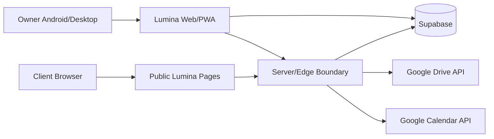

# Lumina — Technical Architecture

**Status:** Draft / current direction

## 1. Architecture goals

- free-tier-first for initial personal use
- mobile-first web/PWA
- future Android packaging without rewrite
- secure direct data access using Supabase RLS where appropriate
- server boundary for privileged/public/OAuth operations
- external large-media storage
- simple deployment and local development
- migration-friendly relational data model

## 2. Current stack direction

| Layer | Choice | Status |
|---|---|---|
| Language | TypeScript | Proposed/accepted for planning |
| Frontend | React | Proposed/accepted for planning |
| Build | Vite | Proposed/accepted for planning |
| Styling | Tailwind CSS | Proposed |
| UI primitives | shadcn/ui or equivalent | Proposed |
| Server state | TanStack Query | Proposed |
| Forms | React Hook Form | Proposed |
| Validation | Zod | Proposed |
| PWA | Web manifest + service worker strategy | Proposed |
| Native shell later | Capacitor | Proposed |
| Backend | Supabase | Proposed/accepted for planning |
| Database | PostgreSQL | Proposed/accepted for planning |
| Auth | Supabase Auth | Proposed |
| App storage | Supabase Storage | Proposed |
| Large media | Google Drive | Proposed |
| Calendar | Google Calendar API | Proposed |
| Hosting | Cloudflare | Proposed |

Create ADRs when these become implementation commitments.

## 3. System context

## 4. Trust boundaries

### Browser owner app
May hold:
- normal authenticated session
- public anon key as intended by Supabase

Must not hold:
- service role key
- OAuth refresh tokens
- privileged server secrets

### Public client browser
Must access only explicit public endpoints/projections.

### Server/edge
Responsible for:
- privileged token exchange
- public share token resolution
- protected Google API calls where needed
- secret storage access
- high-risk business operations if they should not be direct client mutations

## 5. Data access pattern

Define per use case:

| Use case | Direct Supabase client? | Server function? | Why |
|---|---:|---:|---|
| Owner reads own projects | likely yes | no | protected by RLS |
| Owner CRUD simple records | likely yes | sometimes | RLS + validation |
| Public project share | no | yes | allow-list projection/token |
| Client brief submit | no/limited | yes | public validation + review queue |
| OAuth exchange | no | yes | secrets/tokens |
| Google API operation | no/limited | yes | protected credentials |

Finalize after schema/security review.

## 6. Offline strategy

Do not promise full offline mutation until designed.

Decide:
- app shell caching
- last-viewed project read cache
- queued writes vs disabled writes
- conflict handling
- update strategy

Record accepted behavior before PWA implementation.

## 7. Error model

Define standardized categories:
- validation
- authentication
- authorization
- not found
- conflict
- external provider unavailable
- rate limited
- network/offline
- unexpected

User-facing messages must not leak secrets/internal SQL/provider details.

## 8. Observability

MVP minimum:
- structured server logs
- integration failure logging
- correlation/request IDs where practical
- client error reporting decision
- audit trail for high-risk actions such as force-close/public link revoke

## 9. Deployment

Document:
- environments: local / preview / production
- Supabase project strategy
- environment variables
- migrations
- seed strategy
- Cloudflare deployment
- rollback/forward-fix process

## 10. Architecture constraints

- no media-heavy backend
- no accidental multi-tenant leakage
- no template references that mutate historical project truth
- no business-critical state encoded only in UI
- no public direct access to private project rows

## 11. Open architecture questions

- SPA routing/public route strategy
- server runtime choice for Cloudflare + Supabase functions
- service-worker library
- local-first scope
- rich-text editor selection
- form-builder data model
- calendar sync direction
- Drive Picker vs API access split
