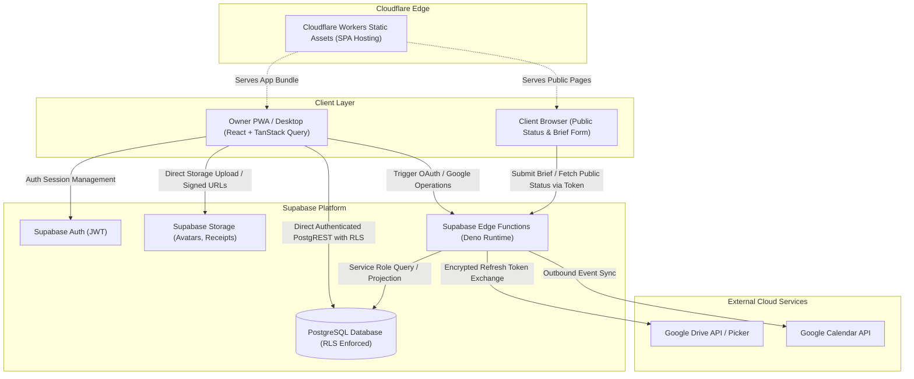

# Lumina — Technical Architecture Specification

**Status:** Technical Consensus / Pass B Locked
**Last updated:** 2026-08-14

---

## 1. Architecture Goals & Principles

- **Free-Tier-First:** Minimal operational cost for personal single-operator use, leveraging Cloudflare Workers Static Assets and Supabase Free Tier.
- **Mobile-First PWA:** Fast, responsive web application installed on Android home screens, fully adapted for desktop screen density.
- **Direct-to-Database with RLS:** Direct PostgREST queries from authenticated browser for standard CRUD, protected by PostgreSQL Row Level Security.
- **Strict Server Isolation for Privileged Ops:** Single dedicated Edge Function boundary (Supabase Edge Functions) for OAuth, external APIs, and anonymous public access.
- **External Large Media:** Production media (RAW photos, 4K video footage) remains strictly in Google Drive; Lumina only stores metadata references.
- **Future-Safe Single-User Core:** Multi-tenant workspace schema from day one without burdening the MVP UI with multi-user team complexity.

---

## 2. Technology Stack Commitments

| Layer | Technology | Decision & Rationale | Status |
|---|---|---|---|
| **Language** | TypeScript | Strict type safety across client, edge functions, and schema types. | Accepted |
| **Frontend Framework** | React (current stable generation) | Standard component ecosystem, optimal pairing with Vite and UI primitives. | Accepted |
| **Build & Tooling** | Vite (current supported stable) | Fast HMR, optimized production rollup builds, native PWA plugin support. | Accepted |
| **Styling** | Tailwind CSS | Utility-first design tokens matching `DESIGN.md` palette and surface hierarchy. | Accepted |
| **UI Primitives** | shadcn/ui (Radix UI + Lucide) | Accessible, unstyled primitives with clean mobile-first custom styling. | Accepted |
| **Server State & Cache** | TanStack Query | Robust cache management, offline read persistence, automatic background refetching. | Accepted |
| **Forms & Validation** | React Hook Form + Zod | High-performance uncontrolled forms with shared TypeScript/Zod validation schemas. | Accepted |
| **PWA & Service Worker** | `vite-plugin-pwa` (Workbox) | App shell caching, installable Android web app, background asset pre-caching. | Accepted |
| **Backend & Database** | PostgreSQL (via Supabase) | Relational integrity, foreign keys, JSONB for brief fields, native RLS. | Accepted |
| **Auth** | Supabase Auth | Secure JWT/session management, email/password or magic link authentication. | Accepted |
| **Server Boundary** | Supabase Edge Functions (Deno) | Unified TypeScript serverless runtime for OAuth, public tokens, and Google APIs. | Accepted |
| **App Storage** | Supabase Storage | S3-compatible private/public storage for small attachments (receipts, avatars). | Accepted |
| **Large Media Storage** | Google Drive API | External cloud storage for RAW files, delivery exports, and media folders. | Accepted |
| **Calendar Integration** | Google Calendar API | Dedicated project event outbound sync and free/busy collision checking. | Accepted |
| **Static Hosting** | Cloudflare Workers Static Assets | Global edge static delivery for SPA bundle with zero hosting costs. | Accepted |
| **Mobile Shell (Future)** | Capacitor | Future native packaging wrapper if Google Play store distribution is needed. | Deferred (Later) |

---

## 3. System Context & Topography



---

## 4. Trust Boundaries & Data Access Patterns

### 4.1 Boundary Matrix

| Actor / Client | Authentication | Database Access Route | Direct Access Allowed? | Key Held |
|---|---|---|---|---|
| **Owner App** | Supabase Auth JWT | PostgREST API with Row Level Security | **YES** (Owner's workspace rows only) | `anon_key`, User JWT |
| **Public Client Browser** | Anonymous (Unauthenticated) | None (Direct DB queries strictly blocked) | **NO** (Must route via Edge Function) | None (Public Token in URL) |
| **Supabase Edge Function** | Verified Caller (JWT or Public Token) | Direct Postgres / Service Role Client | **YES** (Bypasses RLS with allow-list projections) | `service_role_key`, `GOOGLE_CLIENT_SECRET` |

### 4.2 Single Server Runtime Commitment
To avoid operational complexity and split-brain backend environments, **all backend logic resides in Supabase Edge Functions (Deno/TypeScript)**. Cloudflare is used strictly for static asset hosting (Cloudflare Workers Static Assets). This is a hosting mechanism update aligned with Cloudflare's modern deployment standards, not a second application backend. This ensures:
- Single local development emulator (`supabase functions serve`).
- Single secret management store (`supabase secrets set`).
- Direct low-latency co-located database connection to PostgreSQL.

---

## 5. PWA & Offline Strategy

Lumina is designed as an installable Progressive Web App (PWA) on Android and Desktop:

### 5.1 Caching Strategy
- **App Shell (Cache-First):** HTML, compiled JS, CSS, Lucide icons, and web fonts are cached via Workbox service worker for instant cold start.
- **Project Data (Network-First with IndexedDB Persistence):** Active projects, schedules, and dashboard queries are cached using TanStack Query’s `persistQueryClient` backed by IndexedDB (`idb-keyval`).

### 5.2 Offline Operational Posture
- **Read Operations:** Owner can inspect previously loaded projects, client contacts, brief details, and upcoming shoots while completely offline.
- **Write Operations (MVP):** Mutations (create project, update status, record payment) are **gracefully disabled** when offline. The UI displays an explicit non-intrusive offline indicator: *"You are offline. Reconnect to make changes."*
- **Rationale:** Avoids complex multi-master optimistic sync queues and merge conflict resolution in MVP while ensuring high field reliability.

---

## 6. Standardized Error Handling Model

All client-facing and edge function errors adhere to a structured JSON response contract:

```typescript
interface AppErrorResponse {
  error: {
    code: ErrorCode;
    message: string;
    details?: Record<string, unknown>;
    timestamp: string;
  };
}

type ErrorCode =
  | 'VALIDATION_ERROR'        // Request schema / Zod validation failure
  | 'UNAUTHENTICATED'         // Missing or expired JWT session
  | 'FORBIDDEN'               // Valid session but unauthorized workspace action
  | 'NOT_FOUND'               // Entity does not exist
  | 'CONFLICT'                // Invariant or unique constraint violation
  | 'TOKEN_EXPIRED'           // Public share link or OAuth token expired
  | 'TOKEN_REVOKED'           // Public share link was revoked by owner
  | 'EXTERNAL_SERVICE_ERROR'  // Google API or storage provider failure
  | 'RATE_LIMITED'            // Excessive public submissions
  | 'NETWORK_OFFLINE'         // Client device offline
  | 'INTERNAL_ERROR';         // Unexpected unhandled system fault
```

**Security Invariant:** Error messages returned to public or client surfaces must never leak raw PostgreSQL errors, table names, SQL constraints, or server file paths.

---

## 7. Observability & Audit Logging

- **Structured Server Logging:** Edge Functions output structured JSON logs containing `timestamp`, `event`, `workspace_id`, `caller_type`, `request_id`, and `duration_ms`.
- **Database Audit Trail:** High-consequence operational and security events are recorded in an append-only `audit_logs` table:
  - Project force-close events (with mandatory reason).
  - Public share link creation, regeneration, and revocation.
  - Client brief submission review accept/reject batches.
  - Google integration connect / disconnect events.

---

## 8. Environments & Deployment Topology

| Environment | Frontend Deployment | Supabase Instance | Database Branching |
|---|---|---|---|
| **Local Development** | Vite Dev Server (`localhost:5173`) | Local Supabase CLI Docker (`127.0.0.1:54321`) | Local migration files via `supabase migration up` |
| **Preview / Staging** | Cloudflare Workers Static Assets (Preview) | Supabase Staging Project | Supabase CLI migration deployment |
| **Production** | Cloudflare Workers Static Assets (`main` branch) | Supabase Production Project | Automated CI/CD migration pipeline with rollback plan |

---

## 9. Architectural Constraints & Non-Goals

1. **No Media Streaming / Video Processing Backend:** Lumina will not transcode, compress, or stream video/audio.
2. **No Multi-Tenant UI in MVP:** Workspace schema is present from day one, but UI assumes one owner per workspace.
3. **No Direct Public Table Access:** Public users never execute direct SQL `SELECT` against internal project rows.
4. **No Ephemeral In-Memory State:** All state is persisted in PostgreSQL or external providers (Drive/Calendar).
