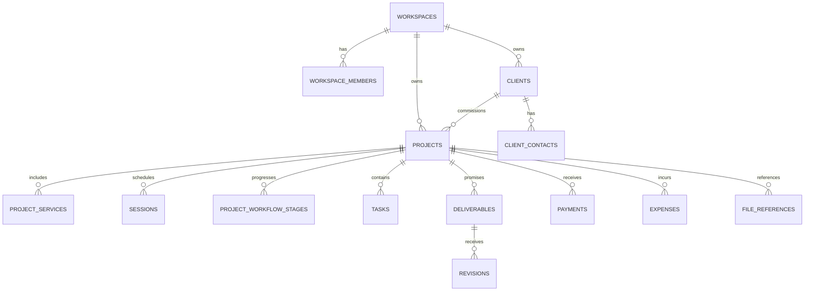

# Lumina — Database Schema Specification

**Status:** Draft  
**Database:** PostgreSQL via Supabase

This document owns the logical/physical data schema, constraints, indexes, RLS expectations, and migration notes.

## 1. Design rules

1. Every business row belongs to a workspace where appropriate.
2. MVP may expose only one owner, but workspace scoping exists from day one.
3. Historical project data uses snapshots.
4. Relationships use explicit foreign keys.
5. Business invariants are enforced in the database when practical.
6. Public access does not equal broad table SELECT.
7. Exposed Supabase tables must have intentional RLS.
8. Schema changes are migrations, not dashboard-only edits.

## 2. Naming conventions

Decide before first migration:

- SQL identifiers: `snake_case`
- primary keys: UUID
- timestamps: `timestamptz`
- money: integer minor units OR numeric — choose once
- soft delete: only where justified
- enum strategy: PostgreSQL enum vs check constraint vs lookup table — document per case

## 3. Core tables

Do not implement until fields are reviewed.

### `workspaces`
Purpose:
- logical tenant/data ownership boundary

Candidate columns:
- id
- name
- created_at
- updated_at

### `workspace_members`
- workspace_id
- user_id
- role
- created_at

MVP may only use `owner`.

### `clients`
- id
- workspace_id
- display_name
- type/custom metadata
- notes
- created_at
- updated_at

### `client_contacts`
- id
- workspace_id
- client_id
- name
- email
- phone
- role_label
- is_primary

### `projects`
Candidate only:
- id
- workspace_id
- client_id
- title
- project_number
- status/closure fields
- currency
- start/end dates as needed
- client_approved_at
- closed_at
- force_closed_at
- force_close_reason
- created_at
- updated_at

Do not encode every workflow stage in one global project enum if project workflows remain customizable.

### `services`
Reusable service catalog.

### `packages`
Reusable commercial templates.

### `package_items`
Package → service lines/defaults.

### `project_services`
Historical snapshot.

Candidate:
- project_id
- source_package_id nullable
- source_package_version/value metadata if needed
- service label snapshot
- description snapshot
- quantity
- unit_price
- discount/adjustment
- line_total

### `sessions`
- project_id
- type
- title
- starts_at
- ends_at
- location fields
- status
- google_event_id nullable

### `workflow_templates`
### `workflow_template_stages`
### `project_workflow_stages`

Project stages are snapshots and editable.

### `tasks`
- project_id
- stage_id nullable
- deliverable_id nullable
- title
- status
- due_at
- completed_at
- sort_order

### `brief_templates`
### `brief_template_sections`
### `brief_template_fields`

### `briefs`
Project-owned snapshot.

### `brief_sections`
### `brief_fields`
Need a strategy for typed values.

Do not create an unbounded JSON blob without deciding:
- querying needs
- validation
- migrations
- public visibility
- template evolution

### `brief_submissions`
Store client submissions separately from canonical data.

### `brief_submission_values`
or JSON payload if justified and validated.

### `deliverables`
- project_id
- project_service_id nullable
- title
- description
- due_at
- status
- delivered_at
- approved_at

### `revisions`
- deliverable_id
- revision_number
- requested_at
- due_at
- status
- feedback
- delivered_at
- approved_at

Unique constraint candidate:
`(deliverable_id, revision_number)`

### `payments`
- project_id
- type
- amount
- due_at
- paid_at
- status
- reference/note

### `expenses`
- project_id
- category
- amount
- incurred_at
- collaborator_engagement_id nullable
- note

### `collaborators`
Workspace contact record, not necessarily a Lumina user.

### `collaborator_engagements`
- project_id
- collaborator_id
- role_label
- agreed_fee
- payment status
- notes

Decide whether collaborator fee is mirrored into `expenses` or derived; never double count.

### `file_references`
- project_id
- deliverable_id nullable
- provider
- external_id nullable
- display_name
- url / provider metadata
- visibility
- kind
- created_at

### `client_share_links`
Never store raw share token if avoidable.

Candidate:
- id
- project_id
- token_hash
- expires_at
- revoked_at
- permissions/config
- created_at

## 4. Relationship ERD

Update once schema is accepted.

## 5. Constraints

Track each important constraint.

| ID | Table(s) | Rule | DB enforcement |
|---|---|---|---|
| DBI-001 | revisions | revision number unique per deliverable | unique constraint |
| DBI-002 | payments | amount > 0 | check |
| DBI-003 | expenses | amount >= 0 | check |
| DBI-004 | client_share_links | token hash unique | unique |
| DBI-005 | project services | historical values independent from package | schema design |

## 6. Index plan

Do not add indexes by habit. Add for real query patterns.

Likely query families:
- active projects by workspace
- tasks due today/overdue
- sessions by date range
- unpaid/overdue payments
- deliverables by due date/status
- client projects
- external provider IDs
- share token lookup by hash

Document composite index order based on actual filters/sorts.

## 7. RLS matrix

Required before production.

| Table | Owner SELECT | Owner INSERT | Owner UPDATE | Owner DELETE | Public access |
|---|---:|---:|---:|---:|---|
| projects | workspace member | workspace member | workspace member | policy TBD | none direct |
| payments | workspace member | workspace member | workspace member | workspace member | none |
| expenses | workspace member | workspace member | workspace member | workspace member | none |
| brief_submissions | workspace member | via public endpoint | workspace member | TBD | no direct broad read |

Public/client views should normally be server-projected, not public RLS access to private tables.

## 8. Views / derived values

Potential database views:
- active project summary
- today dashboard items
- project finance summary
- overdue payments
- project progress

Do not materialize until query/profile evidence requires it.

## 9. Migrations

For every migration document:
- forward change
- backfill
- compatibility implications
- data loss risk
- rollback vs forward-fix plan

Migration files are source of truth for deployed schema.

## 10. Seed/fixtures

Create deterministic development fixtures:
- individual graduation photo project
- multi-service corporate event
- multi-session project
- project with revision
- overdue payment
- force-closed project
- public brief pending review

## 11. Database test requirements

Test:
- constraints
- RLS
- critical functions/triggers
- snapshot/history invariants
- finance calculations
- public access denial
