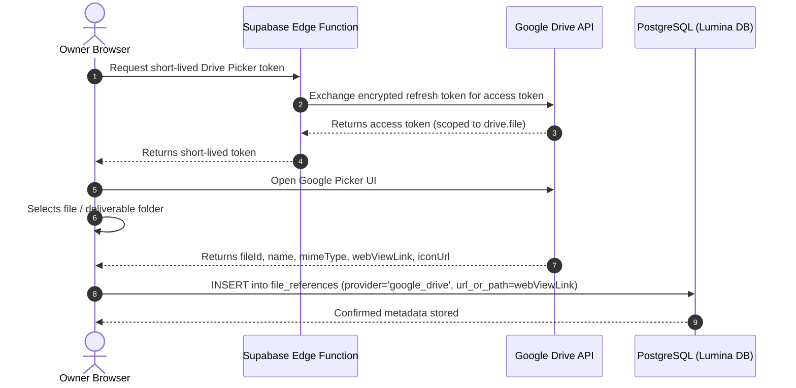

# Lumina — External Integrations Specification

**Status:** Technical Consensus / Pass B Locked
**Last updated:** 2026-08-14

This document defines the integration contracts, OAuth token lifecycle, API boundaries, and error handling for external services: Google Drive, Google Calendar, and Supabase Storage.

---

## 1. Google OAuth & Token Infrastructure

### 1.1 OAuth 2.0 Web Server Flow
- **Authorization Endpoint:** `https://accounts.google.com/o/oauth2/v2/auth`
- **Token Endpoint:** `https://oauth2.googleapis.com/token`
- **Redirect URI:** `https://<supabase-project>.supabase.co/functions/v1/oauth-google-callback`
- **Requested Scopes:**
  - `https://www.googleapis.com/auth/drive.file` (Per-file access: view and manage files/folders created or opened by Lumina).
  - `https://www.googleapis.com/auth/calendar.events` (Manage events on Lumina-specific project calendar).
  - `https://www.googleapis.com/auth/calendar.freebusy` (Read free/busy availability for conflict detection).

### 1.2 Server-Side Token Security
```sql
CREATE TABLE oauth_credentials (
    id UUID PRIMARY KEY DEFAULT gen_random_uuid(),
    workspace_id UUID NOT NULL UNIQUE REFERENCES workspaces(id) ON DELETE CASCADE,
    provider TEXT NOT NULL DEFAULT 'google' CHECK (provider = 'google'),
    encrypted_refresh_token TEXT NOT NULL,
    access_token TEXT,
    access_token_expires_at TIMESTAMPTZ,
    google_calendar_id TEXT, -- ID of dedicated Lumina calendar
    created_at TIMESTAMPTZ NOT NULL DEFAULT NOW(),
    updated_at TIMESTAMPTZ NOT NULL DEFAULT NOW()
);
```

- Refresh tokens are encrypted with AES-256-GCM using `ENCRYPTION_KEY` inside Supabase Edge Functions before database write.
- Access tokens are cached in memory/database until expiration (typically 1 hour) and refreshed automatically by Edge Functions.
- Browser client never receives or stores the OAuth refresh token.

### 1.3 Disconnection & Revocation Flow
1. Owner clicks "Disconnect Google Account" in Settings.
2. Edge Function calls Google Token Revocation endpoint: `POST https://oauth2.googleapis.com/revoke?token={token}`.
3. Edge Function deletes the `oauth_credentials` row.
4. Existing `file_references` remain as static URL links; calendar synchronization is cleanly unhooked.

---

## 2. Google Drive Integration Contract

### 2.1 Intended Role & Architecture
- **Large Media Principle (`INV-009`):** Large production files (RAW photos, 4K video footage, final ZIP archives) remain in the user's external Google Drive.
- **Picker-Based Selection:** Lumina does not crawl the user's entire drive. It uses the official Google Picker API in the browser.

### 2.2 Integration Flow Diagram



### 2.3 Error & Edge Case Behavior
- **File Moved/Deleted in Drive:** Lumina displays the stored file name with an external link indicator. If the link returns a 404 in Drive, the owner can update or remove the reference in Lumina.
- **Permission Boundary:** Files shared with clients via public status pages must have appropriate Google Drive sharing settings (e.g. "Anyone with the link can view"). Lumina documents this in the UI helper tooltip.

---

## 3. Google Calendar Integration Contract

### 3.1 Intended Role & Calendar Ownership
- **Lumina is Canonical:** Project sessions (shoots, meetings, event days) and deliverable deadlines originate in Lumina.
- **Dedicated Project Calendar:** Upon connecting Google Calendar, Lumina creates a dedicated secondary calendar named `"Lumina Projects"` to avoid polluting the owner's primary personal calendar.
- **Sync Direction:** Outbound sync from Lumina → Google Calendar.

### 3.2 Synced Event Payloads
When a `sessions` record is created or updated:
- **Summary:** `[Lumina] {Project Title} — {Session Title}` (e.g. `[Lumina] Rani & Andi — Pre-wedding Shoot`)
- **Description:** Session notes + direct link to Lumina project screen.
- **Location:** `sessions.location` text.
- **Start / End:** `date` + `start_time` / `end_time` with timezone.
- **Idempotency:** Google Event ID is saved to `sessions.google_calendar_event_id`. Subsequent edits update the existing Google event.

### 3.3 Free/Busy Conflict Detection
When an owner schedules or reschedules a session:
1. Frontend calls Edge Function `/check-calendar-conflict?date=...&start=...&end=...`.
2. Edge Function queries `https://www.googleapis.com/calendar/v3/freeBusy` across the owner's primary and secondary calendars.
3. If an overlapping event exists, Lumina displays a non-blocking warning banner: *"Conflict detected with an existing Google Calendar event at this time."*

---

## 4. Supabase Storage Architecture

### 4.1 Bucket Specification

| Bucket Name | Privacy Level | Max File Size | Allowed MIME Types | Intended Content |
|---|---|---|---|---|
| `avatars` | Public CDN | 2 MB | `image/jpeg`, `image/png`, `image/webp` | Owner and client contact profile pictures |
| `receipts` | Private (Auth only) | 5 MB | `image/*`, `application/pdf` | Project expense receipts |
| `brief-attachments` | Private (Auth only) | 10 MB | Images, PDFs, DOCX | Client reference documents / shot lists |
| `project-covers` | Public CDN | 5 MB | `image/jpeg`, `image/png`, `image/webp` | Project header cover images |

### 4.2 Storage RLS & Access Policies
- Private bucket downloads require short-lived signed URLs generated via PostgREST/Supabase client (`supabase.storage.from('receipts').createSignedUrl(path, 300)`).
- Public buckets are served directly from Supabase CDN with immutable cache headers.
