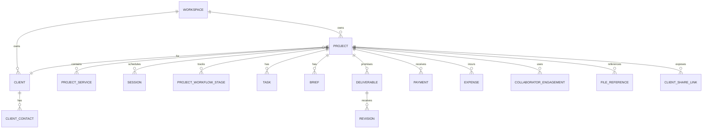

# Lumina — Domain Model & Glossary

**Status:** Draft

This document defines business nouns, ownership, invariants, and relationships independently from physical SQL tables.

## 1. Core aggregate

### Workspace
Logical owner boundary for all business data.

MVP UI may have only one owner and no team-management surface.

### Project
The central unit of client work.

A project can have:
- one client account/entity
- multiple contacts/PICs
- multiple services
- multiple sessions
- one editable workflow
- multiple tasks
- one or more briefs/submissions
- multiple deliverables
- multiple revisions per deliverable
- multiple payments
- multiple expenses
- multiple collaborators
- multiple file references
- a client-share configuration

## 2. Entities

### Client
Customer identity. Can represent an individual, couple, organization, or other custom label.

### Client Contact
A person associated with a client/project.
Examples:
- primary contact
- finance PIC
- event PIC

### Service
A billable type of work such as Photography, Videography, Reels, Same Day Edit.

### Package
Reusable commercial preset containing service lines and defaults.

**Invariant:** Editing a package never rewrites an existing project.

### Project Service
Historical snapshot of the service/price terms used by one project.

### Session
Scheduled project occurrence:
- shoot
- meeting
- pre-production
- event day
- other custom session

### Workflow Template
Reusable stage structure.

### Project Workflow Stage
Project-owned stage snapshot, editable independently of its source template.

### Task
Action item. May be attached to:
- project
- stage
- deliverable

Optional fields:
- due date/time
- priority
- assignee/owner
- completion state

### Brief Template
Reusable form/document structure.

### Brief
Project-owned brief snapshot.

### Brief Field
Typed structured field.

Possible v1 field types:
- short text
- long text
- rich text
- number
- date
- time
- datetime
- single select
- multi select
- checkbox
- checklist
- person/contact
- location
- URL
- file/reference
- schedule/timeline
- section/instruction

Visibility/editability modes:
- internal only
- client can view
- client must/can fill

### Brief Submission
Immutable or versioned client submission pending owner review.

**Invariant:** Client submission does not silently overwrite canonical project data.

### Deliverable
A promised output, e.g. 50 edited photos or a 60–90 second highlight video.

### Revision
Feedback/rework cycle belonging to a deliverable.

### File Reference
Metadata pointing to Lumina app storage or an external provider.

### Payment
Incoming payment record:
- DP
- installment
- final
- other

### Expense
Project cost.

### Collaborator
Non-Lumina-user person such as second shooter or editor.

### Collaborator Engagement
Project-specific role, fee, and payment status for a collaborator.

### Client Share Link
Revocable tokenized public access configuration.

## 3. Derived concepts

### Project Value
Sum of project service line totals + adjustments.

### Paid Amount
Sum of confirmed incoming payments.

### Receivable
Project value minus confirmed paid amount.

### Total Expense
Sum of project expenses + collaborator fees if represented as expenses.

Avoid double counting collaborator fees.

### Projected Profit
Project value minus total expenses.

### Realized Cash
Define explicitly before implementation. Do not assume it equals profit.

## 4. Business invariants

Use stable IDs, e.g. `INV-001`.

- `INV-001`: Package/template edits never mutate historical projects.
- `INV-002`: A revision belongs to exactly one deliverable.
- `INV-003`: Client brief submissions require owner review before changing canonical project fields.
- `INV-004`: Public client views never expose internal-only fields.
- `INV-005`: Project can be force-closed only after explicit confirmation and a recorded reason.
- `INV-006`: One project may contain multiple services.
- `INV-007`: One project may contain multiple sessions.
- `INV-008`: Project workflow is editable after template application.
- `INV-009`: Large production media is external by default.

Add database-enforceable invariants to `DATABASE_SCHEMA.md`.

## 5. Relationships

