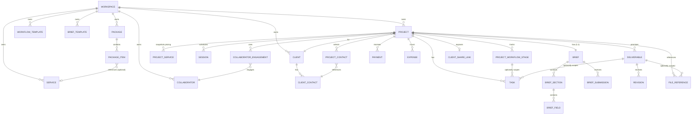

# Lumina — Domain Model & Glossary

**Status:** Locked for schema design  
**Last updated:** 2026-08-14

This document defines business nouns, ownership, invariants, and relationships independently from physical SQL tables. Schema design in `DATABASE_SCHEMA.md` must be consistent with this model.

---

## 1. Aggregates

### Workspace

Logical owner boundary for all business data. Every record in Lumina belongs to exactly one workspace.

MVP has one owner per workspace and no team-management UI. Architecture must not make future multi-user workspaces impossible.

A workspace owns the following catalog/master entities:

- Clients
- Services
- Packages
- Workflow Templates
- Brief Templates
- Collaborators (reusable contact records)
- Projects (and transitively all project-scoped entities)

### Project

The central unit of client work. A project is created after a DP has been received.

A project contains:

- exactly one Client reference
- zero or more ProjectContacts (junction selecting Client Contacts for this project)
- one or more Project Services (pricing snapshot)
- zero or more Sessions
- one editable Workflow (ordered Project Workflow Stages)
- zero or more Tasks
- exactly one Brief (1:1, with sections and fields)
- zero or more Brief Submissions
- zero or more Deliverables
- zero or more Payments
- zero or more Expenses
- zero or more Collaborator Engagements
- zero or more File References
- zero or one Client Share Link configuration

---

## 2. Entities

### Client

Customer identity. Belongs to Workspace.

| Field | Description |
|---|---|
| display_name | Primary display name (e.g., "Rani & Andi", "Telkom Indonesia", "Budi Santoso") |
| client_type | `individual` · `couple` · `organization` · `custom` |
| custom_type_label | Free text when client_type = custom |
| email | Optional |
| phone | Optional |
| notes | Free text |
| archived | Soft-archive flag |

Do not force every client into a company model. "Couple" is a first-class type for wedding/engagement work.

### Client Contact

A person associated with a Client. Belongs to Client.

| Field | Description |
|---|---|
| name | Contact person name |
| role_label | Free text (e.g., "Primary PIC", "Finance PIC", "Event Coordinator") |
| phone | Optional |
| email | Optional |
| notes | Free text |

Example:
```text
Telkom Indonesia (organization)
├─ Rina — Primary PIC
└─ Budi — Finance PIC
```

### ProjectContact (junction)

Links a Client Contact to a Project with project-specific context. Does not duplicate personal contact information.

| Field | Description |
|---|---|
| project_id | References Project (required) |
| client_contact_id | References Client Contact (required) |
| role_label | Project-specific role description (e.g., "Event Coordinator for this project", "Finance PIC") |
| is_primary | Whether this is the primary contact for this project |
| notes | Optional project-specific contact notes |

A contact that exists only for one particular Project is still created as a `ClientContact` under that Client, then associated with that project via `ProjectContact`.

---

### Service

A billable type of work. Belongs to Workspace (catalog).

| Field | Description |
|---|---|
| label | e.g., "Photography", "Videography", "Same Day Edit", "Reels" |
| default_unit_price | Optional informational default |
| description | Optional |
| active | Active/archived state |

### Package

Reusable commercial preset. Belongs to Workspace (catalog).

| Field | Description |
|---|---|
| name | Package name (e.g., "Wedding Gold", "Corporate Standard") |
| description | Optional |
| active | Active/archived state |

A Package contains one or more **Package Items**.

**Invariant (INV-001):** Editing a package never rewrites an existing project.

### Package Item

A line item within a Package.

| Field | Description |
|---|---|
| package_id | Parent package |
| service_id | References a Service (nullable for custom lines) |
| label | Display label (may differ from service label) |
| quantity | Default quantity |
| unit_price | Default unit price |
| description | Optional |
| position | Display order |

### Project Service (snapshot)

Project-owned snapshot of the service/price terms used by one project. Created when a project is set up from a package or manually.

| Field | Description |
|---|---|
| project_id | Parent project |
| label | Snapshotted service label |
| description | Snapshotted description |
| quantity | Actual quantity for this project |
| unit_price | Actual unit price for this project |
| subtotal | quantity × unit_price (or override) |
| adjustment_label | Optional (e.g., "Discount", "Extra Hour") |
| adjustment_amount | Positive or negative amount |
| source_package_id | Audit reference only — NOT a live binding |
| source_service_id | Audit reference only — NOT a live binding |
| position | Display order |

**Invariant (INV-015):** Source references are for audit trail only. Changing the source package/service has no effect on this record.

---

### Session

Scheduled project occurrence. Belongs to Project.

| Field | Description |
|---|---|
| project_id | Parent project |
| type | `shoot` · `meeting` · `pre_production` · `event_day` · `custom` |
| custom_type_label | Free text when type = custom |
| title | Session title/label |
| date | Date of session |
| start_time | Optional |
| end_time | Optional |
| location | Free text |
| notes | Free text |
| status | `scheduled` · `completed` · `cancelled` (see WORKFLOWS.md) |

---

### Workflow Template

Reusable stage structure. Belongs to Workspace (catalog).

| Field | Description |
|---|---|
| name | Template name (e.g., "Wedding Standard", "Corporate Event") |
| description | Optional |
| active | Active/archived state |

Contains ordered **Workflow Template Stages** (label + position + optional defaults).

### Project Workflow Stage (snapshot)

Project-owned stage, editable independently of its source template. Belongs to Project.

| Field | Description |
|---|---|
| project_id | Parent project |
| label | Stage label (e.g., "Preparation", "Shoot", "Editing", "Delivery") |
| position | Display/execution order |
| status | `not_started` · `active` · `completed` · `skipped` (see WORKFLOWS.md) |
| source_template_id | Audit reference only |

Owner can add, remove, rename, reorder, and skip stages freely.

**Invariant (INV-008):** Project workflow is editable after template application.

---

### Task

Action item. Belongs to one Project, optionally scoped to one Stage and/or one Deliverable.

| Field | Description |
|---|---|
| project_id | Required |
| stage_id | Optional — scopes task to a workflow stage |
| deliverable_id | Optional — scopes task to a deliverable |
| title | Task description |
| due_date | Optional |
| status | `open` · `done` (see WORKFLOWS.md) |
| notes | Optional |

**Invariant (INV-014):** A task belongs to exactly one project. Stage and deliverable scoping are optional and independent of each other.

MVP does not include priority, assignee, subtasks, or dependency tracking. These may be added later without breaking the model.

---

### Brief

Project-owned structured document. **Exactly one per project (1:1).**

| Field | Description |
|---|---|
| project_id | Parent project (unique — enforces 1:1) |
| source_template_id | Audit reference to the Brief Template used, if any |
| title | Brief title (optional, defaults to project name) |

A Brief contains ordered **Brief Sections**. Each section contains ordered **Brief Fields**.

**Invariant (INV-011):** A brief belongs to exactly one project (1:1). Every project has exactly one canonical brief.

### Brief Section

| Field | Description |
|---|---|
| brief_id | Parent brief |
| label | Section heading (e.g., "Event Information", "Objective", "Must Capture") |
| instruction_text | Optional helper/instruction text shown to the filler |
| position | Display order |

### Brief Field

Typed structured field within a Brief Section.

| Field | Description |
|---|---|
| section_id | Parent section |
| field_type | See field type list below |
| label | Field label shown to user |
| helper_text | Optional hint text |
| required | Whether the field must be filled |
| visibility | `internal_only` · `client_can_view` · `client_can_fill` · `client_must_fill` |
| value | Owner's canonical value (storage format deferred to Pass B) |
| position | Display order |

**Field types (v1):**

| Type | Description |
|---|---|
| short_text | Single-line text |
| long_text | Multi-line plain text |
| rich_text | Rich/formatted text |
| number | Numeric value |
| date | Date only |
| time | Time only |
| datetime | Date + time |
| single_select | Choose one from options |
| multi_select | Choose multiple from options |
| checkbox | Boolean yes/no |
| checklist | Ordered list of checkable items |
| person_contact | Reference to a contact/person |
| location | Location/address |
| url | Web link |
| file_reference | Attached file or link |
| schedule_timeline | Structured schedule/timeline entries |

`section_heading` and `instruction_text` are handled at the Brief Section level, not as field types.

### Brief Submission

Immutable snapshot of client-provided field values. Belongs to one Brief (many submissions per brief).

| Field | Description |
|---|---|
| brief_id | Parent brief |
| submitted_at | Timestamp |
| review_status | `pending` · `reviewed` |
| reviewed_at | Timestamp when owner completed review |

Per-field accept/reject decisions are stored as part of the submission review (structure deferred to Pass B).

**Invariant (INV-003):** Client brief submissions require owner review before changing canonical project fields.

**Invariant (INV-012):** Brief submissions are immutable after creation. The owner's accept/reject decisions do not modify the submission record itself — they update the canonical Brief field values.

---

### Deliverable

A promised output. Belongs to Project.

| Field | Description |
|---|---|
| project_id | Parent project |
| label | e.g., "50 Edited Photos", "Highlight Video", "Reels Video" |
| quantity | Optional (e.g., 50 for "50 Edited Photos") |
| type_label | Optional category (e.g., "Photos", "Video") |
| deadline | Optional due date |
| status | `planned` · `in_progress` · `delivered` · `awaiting_review` · `approved` · `revision_requested` (see WORKFLOWS.md) |
| notes | Optional |

### Revision

Feedback/rework cycle belonging to exactly one Deliverable.

| Field | Description |
|---|---|
| deliverable_id | Parent deliverable |
| revision_number | Auto-incremented per deliverable (1, 2, 3…) |
| requested_date | When revision was requested |
| due_date | When revised version is due |
| feedback | Client feedback text (rich text) |
| status | `requested` · `in_progress` · `delivered` · `awaiting_review` · `approved` · `changes_requested` (see WORKFLOWS.md) |
| delivered_date | When the revised version was actually sent |
| notes | Optional |

**Invariant (INV-002):** A revision belongs to exactly one deliverable.

---

### Payment

Incoming payment record. Belongs to Project.

| Field | Description |
|---|---|
| project_id | Parent project |
| type | `dp` · `installment` · `final` · `other` |
| label | Optional display label (e.g., "DP 50%", "Installment 2") |
| amount | Payment amount |
| due_date | When payment is due |
| status | `pending` · `paid` · `waived` (persisted business state; temporal conditions such as `due` or `overdue` are dynamically derived, see WORKFLOWS.md) |
| paid_date | When actually received (null if not yet paid) |
| payment_method | Optional free text (e.g., "Bank Transfer", "Cash") |
| notes | Optional |

### Expense

Project cost. Belongs to Project. **Does not include collaborator fees.**

| Field | Description |
|---|---|
| project_id | Parent project |
| label | e.g., "Transport", "Lens Rental", "Venue Parking" |
| amount | Cost amount |
| date | When the expense occurred |
| category | Free text (future: controlled list) |
| receipt_file_id | Optional reference to a File Reference |
| notes | Optional |

**Invariant (INV-013):** Collaborator fees are separate from project expenses. Profit calculation must sum both independently to avoid double-counting.

---

### Collaborator

Reusable contact record for non-Lumina-user persons. Belongs to Workspace (catalog).

| Field | Description |
|---|---|
| name | Person name |
| phone | Optional |
| email | Optional |
| specialty | Free text (e.g., "Second Shooter", "Video Editor", "Assistant") |
| notes | Optional |

Collaborators are not Lumina users. They are recorded contacts who may be engaged across multiple projects.

### Collaborator Engagement

Project-specific engagement of a Collaborator. Belongs to Project.

| Field | Description |
|---|---|
| project_id | Parent project |
| collaborator_id | References a Collaborator |
| role_label | Project-specific role (e.g., "Second Shooter", "Assistant") |
| agreed_fee | Fee amount agreed for this project |
| payment_status | `unpaid` · `partial` · `paid` |
| paid_amount | Amount paid so far |
| notes | Optional |

---

### File Reference

Metadata pointing to app storage or an external provider. Belongs to Project, optionally scoped to Deliverable or Revision.

| Field | Description |
|---|---|
| project_id | Parent project |
| deliverable_id | Optional — scopes to a deliverable |
| revision_id | Optional — scopes to a revision |
| provider | `app_storage` · `google_drive` · `external_url` |
| display_name | File/folder display name |
| url | URL or storage path |
| mime_type | Optional |
| size_bytes | Optional |
| client_visible | Whether this file is visible on the public project status page |
| notes | Optional |

**Invariant (INV-009):** Large production media (RAW, footage, exports) is external by default. Lumina app storage is for small references (avatars, receipts, brief attachments).

### Client Share Link

Revocable tokenized public access configuration. Belongs to Project.

| Field | Description |
|---|---|
| project_id | Parent project |
| token | Opaque, unique, URL-safe token |
| is_active | Active/revoked state |
| created_at | Creation timestamp |
| revoked_at | Revocation timestamp (null if active) |
| visible_sections | Allow-list of what the client can see |

**Invariant (INV-004):** Public client views never expose internal-only fields (profit, expenses, collaborator fees, internal notes, internal tasks, other clients, private brief fields).

---

## 3. Derived concepts

These are computed from entity data. They are not stored as independent records.

| Concept | Formula | Notes |
|---|---|---|
| **Project Value** | `SUM(Project Service net line totals)` | Base value of all services and adjustments |
| **Paid Amount** | `SUM(Payment.amount WHERE status = 'paid')` | Actual confirmed received payments |
| **Receivable** | `Project Value − Paid Amount` | Cash balance owed by client |
| **Generic Expenses** | `SUM(Expense.amount)` | Non-collaborator project costs (transport, rental, etc.) |
| **Committed Collaborator Cost** | `SUM(CollaboratorEngagement.agreed_fee)` | Committed fees for external collaborators |
| **Total Project Cost** | `Generic Expenses + Committed Collaborator Cost` | Sum of generic expenses and collaborator fees |
| **Projected Profit** | `Project Value − Total Project Cost` | Expected project net profit |
| **Margin** | `Projected Profit / Project Value × 100` | Profit percentage margin |

Notes:
- Collaborator fees and generic expenses are summed independently to avoid double-counting.
- `Paid Amount` only includes payments with persisted status `paid`.
- `Committed Collaborator Cost` uses `agreed_fee` (committed liability), not `paid_amount`.
- UI may visually group generic expenses and collaborator fees together under "Project Costs".

---

## 4. Business invariants

Invariants are categorized by their primary enforcement layer:
- **Structural**: Enforced via relational relationships, foreign keys, and schema constraints.
- **Lifecycle**: Enforced via business workflow and state transition rules.
- **Security / Authorization**: Enforced via access control, public projection allow-lists, and RLS.
- **Domain / Business Rule**: Enforced via application and domain logic.

| ID | Invariant | Enforcement Category |
|---|---|---|
| INV-001 | Package/template edits never mutate historical projects. | Domain Rule + Structural |
| INV-002 | A revision belongs to exactly one deliverable. | Structural |
| INV-003 | Client brief submissions require owner review before changing canonical project fields. | Lifecycle + Domain Rule |
| INV-004 | Public client views never expose internal-only fields. | Security / Authorization |
| INV-005 | Project can be force-closed only after explicit confirmation and a recorded reason. Open tasks, unpaid payments, deliverables, and stages remain unchanged. | Lifecycle + Domain Rule |
| INV-006 | One project may contain multiple services. | Structural |
| INV-007 | One project may contain multiple sessions. | Structural |
| INV-008 | Project workflow is editable after template application. | Domain Rule |
| INV-009 | Large production media is external by default. | Domain Rule |
| INV-010 | A project belongs to exactly one client. | Structural |
| INV-011 | A brief belongs to exactly one project (1:1). | Structural |
| INV-012 | Brief submissions are immutable after creation. | Domain Rule + Security |
| INV-013 | Collaborator fees are separate from generic project expenses; profit calculation must sum both independently. | Domain Rule |
| INV-014 | A task belongs to exactly one project, optionally scoped to one stage and/or one deliverable. | Structural |
| INV-015 | Project service values are snapshots; source service/package references are for audit only. | Domain Rule + Structural |

---

## 5. Relationships


