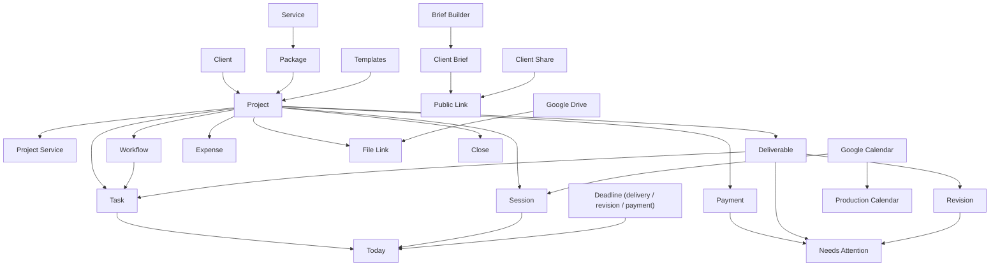

# Lumina — Feature Inventory

**Status:** Baseline prioritization locked for product planning  
**Last updated:** 2026-08-14  
**Purpose:** Canonical feature scope and sequencing before schema/implementation.

## 1. Classification

- **MVP Core** — required for Lumina to function as a useful end-to-end personal project operating system.
- **MVP High-value** — strongly differentiating or workflow-improving, but the core product can still function temporarily without it.
- **Later** — intentionally postponed until the core workflow is proven.
- **Out** — explicitly not part of Lumina unless product direction changes.

Priority is about product necessity, not implementation order.

---

## 2. MVP Core

| ID | Domain | Feature | Why it is Core | Dependencies | Complexity |
|---|---|---|---|---|---|
| F-001 | Projects | Create/edit/archive project | Central record of paid client work | Auth, client | Medium |
| F-002 | Projects | Multi-service project | Real orders can mix photo/video/other services | Project, services | Medium |
| F-003 | Sessions | Multiple sessions per project | One project can contain several shoots/meetings/days | Project | Medium |
| F-004 | Workflow | Editable project workflow stages | Core tracking of project progress | Project | Medium |
| F-005 | Workflow | Skip/add/remove/reorder/rename project stages | Keeps template flow flexible per project | F-004 | Medium |
| F-006 | Tasks | Project/stage/deliverable tasks | Turns project status into concrete work | Project/workflow/deliverable | Medium |
| F-007 | Dashboard | Today | Answers “what do I need to do today?” | Tasks, sessions, deadlines | High |
| F-008 | Dashboard | Needs Attention | Surfaces overdue/blocked/urgent work | Tasks, payment, deliverable | High |
| F-009 | Clients | Client CRUD | Required project ownership/contact context | Workspace | Low |
| F-010 | Clients | Company/individual/custom client identity | Supports freelance and corporate use | F-009 | Medium |
| F-011 | Clients | Multiple client contacts/PICs | Supports primary, finance, event PIC, etc. | F-009 | Medium |
| F-012 | Services | Service catalog | Reusable definition of offered work | Workspace | Low |
| F-013 | Packages | Package CRUD | Reusable commercial presets | Services | Medium |
| F-014 | Packages | Itemized package/service pricing | Orders differ and may combine items | Package/service | Medium |
| F-015 | Packages | Historical project pricing snapshot | Price edits must not mutate old projects | Project/package | High |
| F-016 | Deliverables | Structured deliverables | Explicitly tracks promised outputs | Project/service | Medium |
| F-017 | Deliverables | Deliverable deadline/status | Required for delivery tracking | F-016 | Low |
| F-018 | Revisions | Revision per deliverable | Revision loops differ per output | Deliverables | Medium |
| F-019 | Revisions | Revision feedback/deadline/status | Tracks actual rework instead of counter only | F-018 | Medium |
| F-020 | Finance | Project value | Required commercial baseline | Project services | Low |
| F-021 | Finance | DP/installment/final payments | Core payment flow | Project | Medium |
| F-022 | Finance | Payment due/paid/overdue state | Prevents forgotten receivables | Payments | Low |
| F-023 | Finance | Project expenses | Needed for actual project economics | Project | Low |
| F-024 | Finance | Projected profit/margin | Useful business truth from value vs cost | Revenue/expenses | Low |
| F-025 | Finance | Receivable / paid summary | Shows cash still owed | Payments | Low |
| F-026 | Calendar | Production calendar | Tracks operational dates, not generic personal calendar | Sessions/deadlines | Medium |
| F-027 | Calendar | Shoot/session events | Core schedule visibility | Sessions | Low |
| F-028 | Calendar | Delivery/revision/payment deadlines | Core deadline visibility | Deliverables/revisions/payments | Medium |
| F-029 | Files | External file/folder links | Centralizes project media references without hosting RAW | Project/deliverable | Low |
| F-030 | Files | Small app attachments | Brief PDF, receipt, small references | Storage | Medium |
| F-031 | Project | Normal close rule | Closed after approval + full payment | Deliverables/payments | Medium |
| F-032 | Project | Force-close with confirmation + reason | Handles real exceptions safely | F-031 | Medium |
| F-033 | Project | Project overview / next action | Makes Project Detail the command center | Core domains | High |

---

## 3. MVP High-value

| ID | Domain | Feature | Why High-value, not Core | Dependencies | Complexity |
|---|---|---|---|---|---|
| F-101 | Templates | Project template | Major setup accelerator but project can exist without it | workflow/services/tasks | High |
| F-102 | Templates | Workflow template | Reusable starting flow | Workflow | Medium |
| F-103 | Templates | Template snapshot on project creation | Required once templates ship | Templates | High |
| F-104 | Templates | Save project structure as template | Improves repeated work | Templates | Medium |
| F-105 | Templates | Edit/duplicate/archive template | Makes template system maintainable | Templates | Medium |
| F-106 | Brief | Structured Brief Builder | Distinctive workflow value but not prerequisite for basic tracking | Project/templates | High |
| F-107 | Brief | Reusable brief templates | Speeds recurring project intake | Brief Builder | Medium |
| F-108 | Brief | Mixed structured fields + rich text | Makes briefs flexible without becoming plain notes | Brief Builder | High |
| F-109 | Brief | Per-field internal/view/fill visibility | Required for safe client-facing brief | Brief Builder | High |
| F-110 | Brief | Client-fillable brief share link | Reduces chat back-and-forth | Public link/security | High |
| F-111 | Brief | Client submission review before apply | Prevents client input silently changing project truth | F-110 | High |
| F-112 | Client | Shareable project status page | Strong client-facing differentiator without client account | Public link/security | High |
| F-113 | Client | Revocable public share link | Security requirement for F-112 | Public server boundary | Medium |
| F-114 | Client | Client-visible deliverable/file state | Makes public status genuinely useful | Deliverables/files | Medium |
| F-115 | Collaborators | Collaborator contact record | Useful for second shooter/editor tracking | Project | Medium |
| F-116 | Collaborators | Project role + agreed fee | Connects collaborator cost to project | Collaborator/finance | Medium |
| F-117 | Collaborators | Collaborator fee payment status | Useful operational finance | F-116 | Medium |
| F-118 | Drive | Google Drive Picker/link integration | Removes manual link handling but generic links can substitute initially | OAuth/files | High |
| F-119 | Drive | Project/deliverable association of Drive items | Richer file workflow | F-118 | Medium |
| F-120 | Calendar | Google Calendar outbound sync | Useful external schedule integration | Calendar/OAuth | High |
| F-121 | Calendar | Google free/busy conflict check | Helps avoid schedule collision | Google Calendar | High |
| F-122 | Dashboard | Active Projects summary | Improves visibility beyond Today | Projects/workflow | Medium |
| F-123 | Dashboard | Upcoming Sessions/Shoots | Operational preview | Calendar/sessions | Low |
| F-124 | Dashboard | Finance snapshot | Quick owner business awareness | Finance | Medium |
| F-125 | PWA | Installable Android PWA | Important for intended daily mobile use | Web shell | Medium |
| F-126 | PWA | Basic offline shell / graceful offline state | Improves field usability without promising full offline sync | PWA architecture | Medium |

---

## 4. Later

| ID | Domain | Feature | Why Later |
|---|---|---|---|
| F-201 | Native | Capacitor Android APK/AAB | PWA should validate the product first |
| F-202 | Notifications | Push notifications | Useful after deadlines/tasks are stable |
| F-203 | Client | Full client account/portal | Share links cover current use case with much less complexity |
| F-204 | Client | Client self-service history across projects | Requires client identity/account model |
| F-205 | Team | Multi-user team UI | Current product is single-user-first |
| F-206 | Team | Roles/permissions UI | Not needed for current owner-only use |
| F-207 | Team | Task assignment to Lumina users | Depends on team model |
| F-208 | Integrations | Dropbox integration | Drive first |
| F-209 | Integrations | OneDrive integration | Drive first |
| F-210 | Calendar | Deep bidirectional personal calendar mirroring | Production calendar remains canonical |
| F-211 | Finance | Invoice PDF generation | Useful later, not required for core tracking |
| F-212 | Finance | Payment gateway | Introduces payment/compliance complexity |
| F-213 | Finance | Tax/accounting exports | Outside initial project-finance scope |
| F-214 | Automation | Automatic WhatsApp/email reminders | Add after workflow behavior is stable |
| F-215 | Client | Online booking/inquiry funnel | Current project starts after DP |
| F-216 | Contracts | E-signature / contract workflow | Separate product complexity |
| F-217 | Gallery | Dedicated client proofing gallery | External storage/delivery is enough initially |
| F-218 | AI | AI brief generation | Do not add AI before the manual product workflow is proven |
| F-219 | AI | AI project/task generation beyond deterministic templates | Templates should work without AI |
| F-220 | Analytics | Long-term business analytics | First prove reliable project data capture |

---

## 5. Explicitly Out of Scope

| Feature | Classification | Reason |
|---|---|---|
| Photo editing | Out | Lumina manages work; it does not edit production media |
| Video editing | Out | Same boundary |
| RAW processing | Out | Production-tool responsibility |
| AI photo culling | Out | Not project-management core |
| Full RAW/video cloud archive | Out | Large media remains external |
| Generic Dropbox/Drive replacement | Out | Lumina stores references, not a media DAM |
| Full bookkeeping/accounting | Out | Project finance only |
| Payroll | Out | Collaborator fees are project costs, not payroll |
| Generic CRM lead pipeline before DP | Out for MVP | Current project entry begins after DP |
| Generic personal calendar replacement | Out | Lumina owns production schedule only |
| Enterprise workflow engine | Out | Flexibility must stay understandable |
| Jira/Notion-style arbitrary database builder | Out | Not Lumina’s product goal |

---

## 6. MVP boundary

### MVP Core must prove this complete loop

```text
DP Received
→ Create Client/Project
→ Configure Services/Pricing
→ Track Workflow
→ Schedule Sessions
→ Execute Tasks
→ Track Deliverables
→ Handle Revisions
→ Record Payments/Expenses
→ See Today / Urgent Work
→ Deliver
→ Client Approved
+ Fully Paid
→ Close
```

If this loop is not reliable, High-value integrations/features must not distract from it.

---

## 7. Prioritization rules

A feature does not enter MVP merely because it is attractive.

Promote only if it:
1. supports the real end-to-end project lifecycle,
2. materially reduces manual tracking,
3. cannot be safely substituted temporarily by a simple note/link/external tool,
4. does not add disproportionate platform complexity,
5. reinforces the single-user-first product thesis.

### Differentiation rule

A feature may remain **MVP High-value** when:
- the core loop works without it,
- but it materially differentiates Lumina or eliminates repeated manual work.

This is why the Brief Builder and client share experience are high-value rather than prerequisites for the first valid project lifecycle.

---

## 8. Dependency map



---

## 9. Proposed implementation sequence

This is **not** the final technical task plan. It exists only to expose product dependencies.

### Product Foundation
- clients/contacts
- projects
- services
- packages
- historical pricing snapshot
- sessions

### Execution Core
- project workflow
- tasks
- deliverables
- revisions

### Finance Core
- payments
- expenses
- project financial summary
- close/force-close

### Daily Operating Surface
- Project Detail
- Today
- Needs Attention
- production calendar

### High-value Layer
- project/workflow templates
- brief builder/templates
- client brief submission
- collaborator fees
- public project status
- Google Drive
- Google Calendar
- installable PWA refinement

Implementation order must still be validated against `DOMAIN_MODEL.md`, `ARCHITECTURE.md`, and feature specs.

---

## 10. Scope change rule

Any feature moved between:
- MVP Core
- MVP High-value
- Later
- Out

must include a short reason in the commit/spec.

AI agents must not silently promote Later/Out features into implementation.
