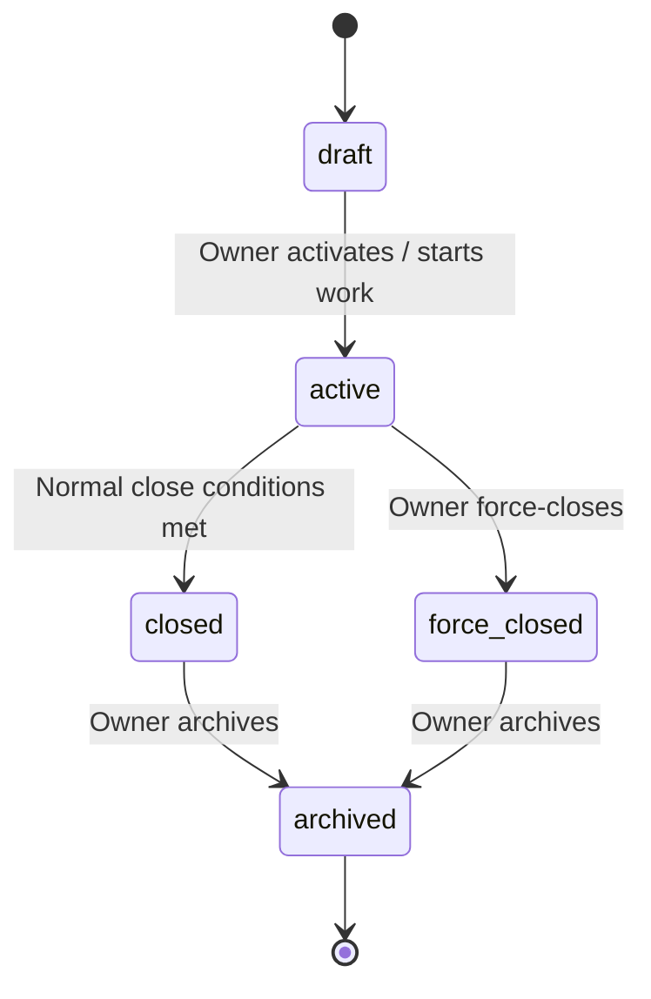
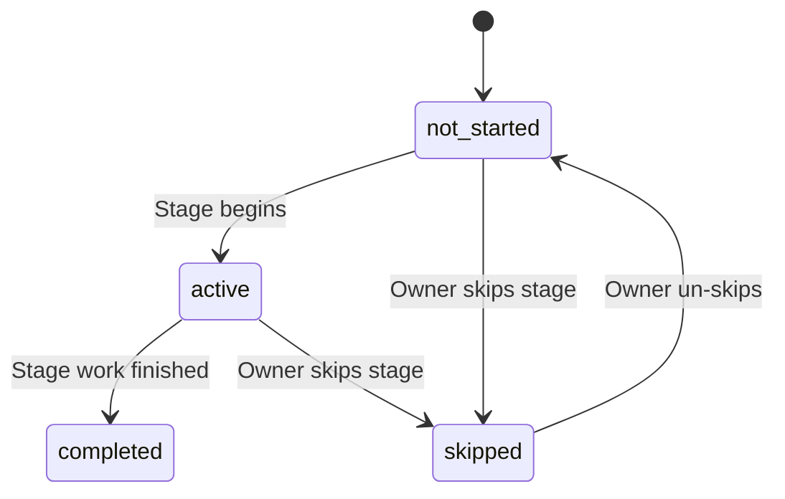
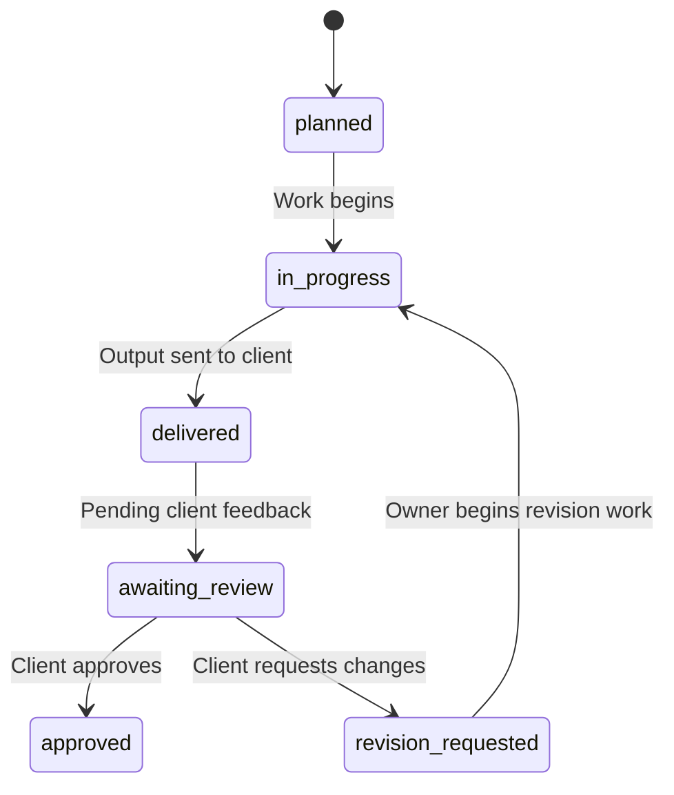
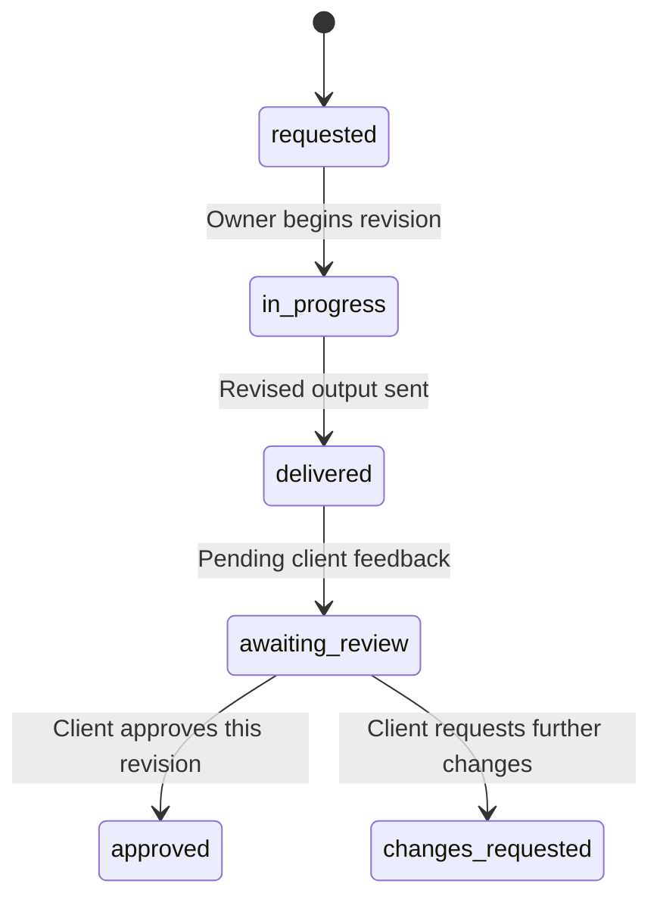
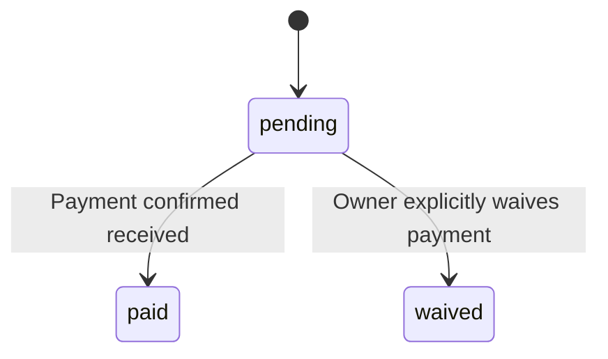
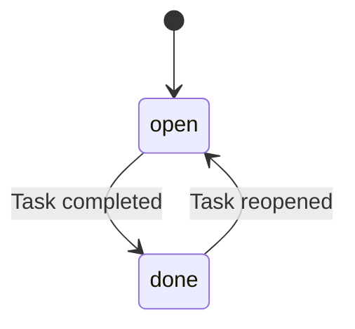
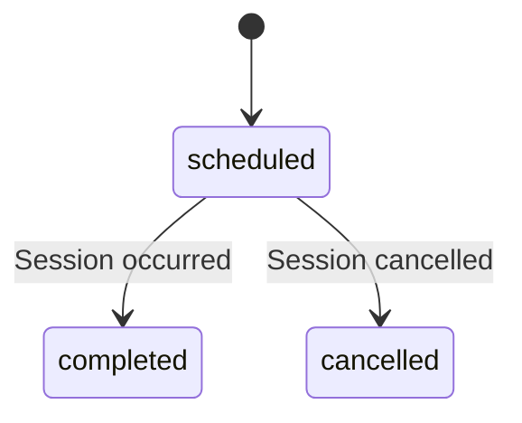

# Lumina — Canonical Workflows & State Rules

**Status:** Locked for schema design  
**Last updated:** 2026-08-14

This file owns cross-feature business flows and state transitions. Entity definitions are in `DOMAIN_MODEL.md`. This file defines how those entities change state.

---

## 1. Project status vs workflow stages

These are two distinct concepts.

### Project status (system-managed)

Represents the system-level lifecycle of a project record.



| Status | Meaning |
|---|---|
| `draft` | Project created but not yet actively worked |
| `active` | Project is in progress |
| `closed` | Normal closure — deliverables approved + fully paid |
| `force_closed` | Closed by owner override with recorded reason |
| `archived` | Historical record, no longer displayed in active views |

### Workflow stages (user-editable)

Represent the production progress **within** an active project. These are user-defined, editable content — not a system enum.

Example stages for a wedding project:
```text
Preparation → Pre-wedding Shoot → Reception → Post-production → Delivery
```

Example stages for a corporate event:
```text
Briefing → Shoot Day → Editing → Review → Final Delivery
```

Workflow stages exist **inside** an active project. They do not replace or overlap with project status.

---

## 2. Project lifecycle

### Canonical flow

```text
DP Received
→ Project Created (draft)
→ Project Activated (active)
→ [User-defined workflow stages progress]
→ Deliverables completed/approved
→ Full payment received
→ Normal Close (closed)
→ Archive when desired (archived)
```

### Entry boundary

A project normally enters Lumina after the initial DP has been received. The system does not manage pre-DP inquiry or booking.

### Normal close

A project is eligible for normal closure when:

1. All deliverables have reached `approved` status (or have been explicitly waived/removed)
2. Total paid amount equals project value (fully paid)

The system should surface eligibility but not auto-close. The owner explicitly closes.

### Force close

Owner may force-close when normal conditions are not met.

**Required:**
- explicit confirmation dialog
- written reason (stored permanently)
- timestamp

**Effects of force-close:**
- Project status → `force_closed`
- All open tasks remain in their current state (not auto-completed)
- All unpaid payments remain unpaid (not auto-marked paid)
- All pending deliverables remain in their current state
- All active workflow stages remain in their current state
- Force-close reason and timestamp are recorded permanently

> [!NOTE]
> Post-force-close operational rules (such as whether force-closed projects become strictly read-only or can be reopened to active, and whether late payments may be recorded) are intentionally unresolved and deferred to future operational design.

**Invariant (INV-005):** Force-close must never silently mark unpaid balances as paid.

---

## 3. Workflow stage states



| Status | Meaning |
|---|---|
| `not_started` | Stage exists but work has not begun |
| `active` | Currently in progress |
| `completed` | Stage work is finished |
| `skipped` | Owner decided to skip this stage for this project |

Multiple stages may be `active` simultaneously. Stage progression is not strictly sequential — the owner controls transitions.

---

## 4. Deliverable states



| Status | Meaning |
|---|---|
| `planned` | Deliverable defined but work not started |
| `in_progress` | Currently being produced |
| `delivered` | Sent to client |
| `awaiting_review` | Waiting for client response |
| `approved` | Client has approved (terminal) |
| `revision_requested` | Client requested changes (creates a Revision entity) |

When a deliverable enters `revision_requested`, a Revision entity is created under it.

After revision work is completed and re-delivered, the deliverable returns to `awaiting_review`.

`approved` is a terminal state. A deliverable may go through multiple revision cycles before reaching `approved`.

---

## 5. Revision states



| Status | Meaning |
|---|---|
| `requested` | Client has requested this revision with feedback |
| `in_progress` | Owner is working on the revision |
| `delivered` | Revised output has been sent |
| `awaiting_review` | Waiting for client response on this revision |
| `approved` | Client approved — this revision (and its parent deliverable) is done |
| `changes_requested` | Client requested further changes; triggers creation of next Revision |

When a revision reaches `approved`:
- The revision is closed
- The parent deliverable status moves to `approved`

When `changes_requested` occurs:
- A new Revision entity is created with an incremented `revision_number`
- Each Revision remains as a historical revision cycle record under the Deliverable

---

## 6. Payment states

Lumina separates **persisted lifecycle state** from **derived temporal conditions**.

### Persisted payment lifecycle

Persisted state changes only upon explicit business events (recording payment or waiving).



| Persisted Status | Meaning |
|---|---|
| `pending` | Payment scheduled / expected |
| `paid` | Payment confirmed received |
| `waived` | Owner has explicitly waived this payment |

### Derived temporal conditions

The operational condition of a payment is dynamically computed from `status`, `due_date`, and the current date:

| Display Condition | Logic |
|---|---|
| `Paid` | `status == paid` |
| `Upcoming` | `status == pending` AND `due_date > today` |
| `Due` | `status == pending` AND `due_date == today` (or within due window) |
| `Overdue` | `status == pending` AND `due_date < today` |
| `Waived` | `status == waived` |

Rules:
- Payment status is independent of project status. Never infer "paid" from project stage.
- Temporal conditions (`Upcoming`, `Due`, `Overdue`) are evaluated dynamically in queries and UI views. They do not require scheduled background state mutation jobs.
- `waived` requires explicit owner action and confirmation. Waiving an overdue payment does not mark it as paid.
- Overdue payments are surfaced in "Needs Attention" on the dashboard.

---

## 7. Task states



| Status | Meaning |
|---|---|
| `open` | Task is pending |
| `done` | Task is completed |

MVP keeps task states intentionally simple. No `in_progress`, `blocked`, or priority levels.

A task with a `due_date` that has passed while status is `open` is considered overdue and should appear in dashboard attention surfaces.

---

## 8. Session states



| Status | Meaning |
|---|---|
| `scheduled` | Session is planned for a future date |
| `completed` | Session has occurred |
| `cancelled` | Session was cancelled |

---

## 9. Deliverable/revision flow (narrative)

Complete lifecycle example:

```text
Deliverable: "Highlight Video"
  Status: planned → in_progress → delivered → awaiting_review

Client: "00:31 replace footage, increase ending logo size"
  Deliverable status → revision_requested
  Revision #1 created (requested → in_progress → delivered → awaiting_review)

Client: "Logo still too small"
  Revision #1 status → changes_requested
  Revision #2 created (requested → in_progress → delivered → awaiting_review)

Client: "Approved"
  Revision #2 status → approved
  Deliverable status → approved
```

---

## 10. Brief flow

```text
Brief Template (workspace catalog)
→ Brief created for project (snapshot, 1:1)
→ Owner customizes sections/fields
→ Owner generates share link
→ Client opens link in browser (no account required)
→ Client fills visible/required fields
→ Client submits
→ Brief Submission created (immutable, status: pending)
→ Owner reviews submission
   ├─ Per-field: accept or reject
   │   Accepted fields → canonical Brief field values updated
   │   Rejected fields → no change to canonical values
   └─ Submission review_status → reviewed
→ Client may submit again → new Brief Submission created
```

### Field-level review

The owner sees a diff between the current canonical Brief field values and the client's submitted values, per field. For each field:

- **Accept**: The canonical Brief field value is updated to the client's submitted value.
- **Reject**: The canonical Brief field value remains unchanged.

The submission record itself is never modified — it preserves the original client input for audit.

**Invariant (INV-003):** Client submission never silently overwrites canonical project data.

**Invariant (INV-012):** Brief submissions are immutable after creation.

---

## 11. Package update flow

```text
Package v1 exists in workspace catalog
→ Project A created, snapshots Package v1 as Project Services
→ Owner edits Package to v2
→ Project A is unchanged (snapshot is project-owned)
→ Project B created, snapshots Package v2 as Project Services
```

**Invariant (INV-001):** Package edits never mutate historical projects.

**Invariant (INV-015):** Project Service source references (package_id, service_id) are for audit trail only, not live bindings.

---

## 12. Project template application

Creating a project from a template may generate:

- Project Workflow Stages (snapshot from Workflow Template)
- Brief (snapshot from Brief Template)
- Tasks (from template defaults)
- Payment schedule defaults
- Deliverables (from template defaults)
- Session placeholders
- File Reference slots
- Client Share Link configuration

All generated content is project-owned and editable. The template is a starting point, not a constraint.

**Invariant (INV-008):** Project workflow is editable after template application.

---

## 13. Calendar flow

Lumina's production calendar surfaces project events. Calendar items are **derived from entity data**, not a separate entity.

Calendar-relevant items:

| Source entity | Calendar event |
|---|---|
| Session | Shoot, meeting, event day |
| Deliverable | Delivery deadline |
| Revision | Revision deadline |
| Payment | Payment due date |
| Task | Task due date (only if explicitly has a due_date) |

Rules:
- Low-level tasks without due dates do not appear on the calendar.
- Overdue items should be visually distinguished on the calendar.
- Calendar items link back to their source entity for navigation.

---

## 14. Public client view

Public project status must be generated from an allow-list projection. The Client Share Link's `visible_sections` field controls what is exposed.

**Allowed (when enabled):**
- project display name
- client-facing stage/progress description
- session date/location
- client-facing status updates
- deliverable status
- approved public files
- expected delivery date

**Never exposed:**
- profit/margin
- expenses
- collaborator fees
- internal notes
- internal tasks
- private brief fields (visibility = `internal_only`)
- other clients
- project financial details beyond what is in the allow-list

**Invariant (INV-004):** Public client views never expose internal-only fields.
